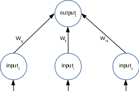

# Perceptron

This code was an assignment from many years ago. It was rewritten to be slightly more modular than its original.

This is the perceptron algorithm. It is a supervised learning and feedforward recall neural network. The algorithm is taken from the "Artificial Neural Systems" book by Patrick K Simpson. By design, this is a first order or single layer topology. It has applications in knowledge processing, pattern recognition, speech processing, sequence recognition, image processing and control.

#### The algorithm

1. Assign random values [1, -1] to all weights and thresholds.
    1. NOTE: The thresholds for this example are set to zero.
    2. Decide how many inputs and outputs there should be where the number of inputs are [1, n] and the number of outputs are [1, p].
2. There are (Ik, Ok) pattern pairs where **k** is [1, m] patterns.
    1. The equation for the activation values is Oj = f(∑WijIi - θj) where **j** is [1, p] and the summation **i** is [1, m].
    2. Using the bipolar step function, set the summation answer, Oj, to 1 if the summation is greater than 0 otherwise -1.
    3. If training then compute the error by taking the desired output minus the calculated output. The equation is Wij = Wij + (α * Ii * (desired Oj - actual Oj)). The learning rate, α, needs to be chosen such that it will converge the output to either zero or some very small error and the learning rate must be positive. A good place to start is to set α to 0.1.
3. Repeat step 2 for all patterns AND until the error output is either zero or some very small error value for all patterns.

#### Code

This code contains an example of how to setup and use the algorithm. It takes in some sequence patterns for binary values and outputs the inverse result, i.e. a 'zero' input would output a 'fifteen'. Only a handful of patterns are trained and once trained,  an untrained pattern is tested. The number of input and output neurons were purposely chosen to be different for this example. It may be compiled simply using this **<i>gcc example.c perceptron.c -o example.out</i>**. (Of course, warnings may be enabled.)

###### Kernel Module
Created a kernel module example for no good reason other than to try it. Converted the floating variables into integer values by multiplying them by 1000.  This is a work-in-progress. Expanded the output neurons to 6 and the input neurons to 7. The training set is larger, but not sufficient enough for some cases that were tried. Building the code is simply **<i>make</i>**. The module can be manually inserted by **<i>sudo insmod perceptron_module.ko</i>**. Removing the module is simply **<i>sudo rmmod perceptron_module.ko</i>**. Once the module is loaded, it will run through the training set. In order to test the trained perceptron run **<i>echo "-1,1,1,1,1,1,1" > /dev/perceptron</i>**. The result can be viewed with **<i>cat /sys/module/perceptron_module/parameters/outputArray</i>**.

#### Basic Perceptron Map

